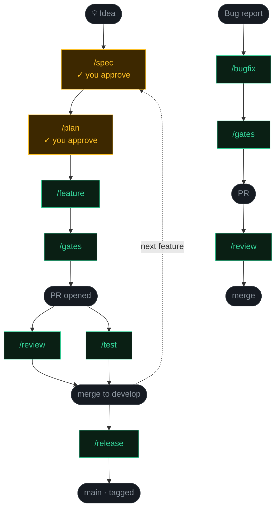

# FinanceTracker

> A production iOS 26.4 personal finance app — and the reference implementation for [Pragma](https://github.com/akshaypimprikar/pragma), a multi-agent Claude Code pipeline that takes every feature from idea to merged PR with two approvals.

[](https://github.com/akshaypimprikar/personal-finance-tracker/actions/workflows/pr-checks.yml)
[](https://developer.apple.com/ios/)
[](https://swift.org)
[](https://github.com/akshaypimprikar/pragma)

**[Pipeline](#pipeline) · [Architecture](#architecture) · [Features](#features) · [Getting Started](#getting-started) · [Build & Test](#build--test)**

---

## Pipeline

Every feature follows the same path. You approve twice — after `/spec` and after `/plan`. Everything else runs autonomously until merge.



You approve twice per feature: after the spec and after the plan. Everything else runs autonomously until you hit merge.

Nine slash commands in `.claude/commands/` define each agent's behaviour — branch strategy, TDD rules, architecture checks, design token enforcement, commit conventions, and PR targets. The commands are open-sourced as a reusable scaffold at [Pragma](https://github.com/akshaypimprikar/pragma).

---

## Architecture

MVVM + Repository. Strict layer separation enforced by the Review Agent on every PR.

```
Views                  — SwiftUI, no business logic
ViewModels             — @Observable, depend on protocols only
Domain Services        — pure Swift, zero SwiftData imports, 100% unit testable
Repository Protocols   — Foundation-only imports
SwiftData Repositories — concrete implementations, swappable
@Model entities        — Account, Transaction, Category, Budget, ImportRecord
```

**Key constraints:**
- All money values use `Decimal`, never `Double`
- `AccountType.creditCard` is a liability — intentional for net worth calculation
- `Transaction.importHash` = SHA256(date+amount+payee) — CSV dedup

---

## Features

- **Dashboard** — net worth, spending this month, budget progress
- **Transactions** — list, search by payee, filter by account, add manually
- **CSV Import** — 3-step flow: file picker → column mapping → preview + dedup
- **Budgets** — monthly limits per category with progress tracking
- **Accounts** — assets + liabilities, net worth calculation
- **Settings** — manage expense/income categories

---

## Tech Stack

| Component | Technology |
|---|---|
| Platform | iOS 26.4 |
| UI | SwiftUI |
| Persistence | SwiftData |
| Testing | Swift Testing (`@Suite`/`@Test`/`#expect`) + XCUITest |
| AI tooling | [Claude Code](https://github.com/akshaypimprikar/pragma) with custom slash commands |

---

## Getting Started

Clone and activate the pre-push git hook:

```bash
git clone https://github.com/akshaypimprikar/financetracker-ios
cd financetracker-ios
git config core.hooksPath .githooks
```

The hook blocks direct pushes to `develop`/`main` and catches pushes to already-merged branches.

---

## Build & Test

All commands run from the repo root (where `FinanceTracker.xcodeproj` lives).

```bash
# Build
xcodebuild build -project FinanceTracker.xcodeproj -scheme FinanceTracker \
  -configuration Debug -destination 'platform=iOS Simulator,name=iPhone 17'

# Unit + integration tests
xcodebuild test -project FinanceTracker.xcodeproj -scheme FinanceTracker \
  -destination 'platform=iOS Simulator,name=iPhone 17' \
  -only-testing:FinanceTrackerTests

# UI tests
xcodebuild test -project FinanceTracker.xcodeproj -scheme FinanceTracker \
  -destination 'platform=iOS Simulator,name=iPhone 17' \
  -only-testing:FinanceTrackerUITests
```

> Simulator: `iPhone 17` — iOS 26.4 ships with iPhone 17 only.

---

## Repo Structure

```
FinanceTracker/          — app source (Models, Services, Repositories, ViewModels, Views)
FinanceTrackerTests/     — unit + integration tests
FinanceTrackerUITests/   — XCUITest flows (5 core user flows)
.claude/commands/        — agent definitions (/spec, /plan, /feature, /review, /test, /bugfix, /release, /sync-workflow, /design)
FinanceTracker/Theme/    — semantic design tokens (Colors, Spacing, Typography)
docs/design-system.md   — token reference and component patterns
docs/superpowers/
  specs/                 — design specs (approved before any code is written)
  plans/                 — implementation plans (approved before the feature agent runs)
CLAUDE.md                — build commands, architecture rules, agent pipeline (always-on context)
CHANGELOG.md             — version history
```

The `docs/superpowers/` directory is the paper trail — every feature has a spec and a plan that predates the code.

---

## Branch Strategy

```
main        — production, tagged on release only
develop     — integration branch, all features merge here
feature/*   — off develop, one per feature
fix/*       — off develop (hotfix/* off main)
release/*   — off develop, PR to main, back-merged to develop
spec/*      — off develop, for spec + plan docs
design/*    — off develop, for Theme token additions
```

---

## Author

Built by [Akshay Pimprikar](https://www.linkedin.com/in/akshaypimprikar) — iOS lead engineer building agentic AI pipelines.
